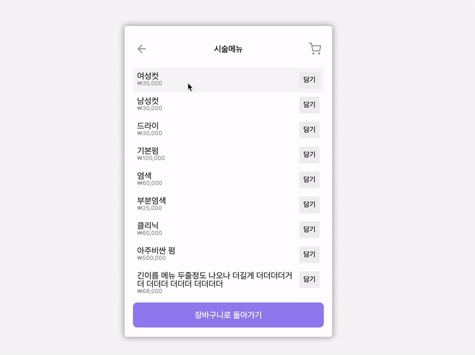

# COLAVO_SHOPPING_CART



## 🌊 느낀점

- 타입스크립트

  항상 궁금했었던 타입스크립트를 처음으로 사용해 보았습니다.
  4일이라는 짧은 기한이 있어서, 자세하게 공부하진 못했으나
  `any`라는 타입을 사용하면 타입스크립트를 사용하는 의미가 없다고 생각하여 `any`는 사용하지 않았으며 들어오는 값, 나가는 값들의 타입을 정확히 적어주려고 노력했습니다.
  처음에는 조금 번거롭게 느껴졌으나, 파일이 커지고 빠르게 개발을 하려다 보니 생기는 실수들을 타입스크립트가 컴파일 단계에서 잡아줘서 좋다고 느꼈습니다. 앞으로 더 학습하여 적극 활용해 볼 생각입니다.

- 상태 구조

  상태의 구조 설계가 얼마나 중요한지 다시 한번 느꼈습니다.
  아이템과 할인의 관계를 깊게 생각하지 않고 개발을 진행하여 결국 할인과 아이템이 함께 얽힌 부분들의 로직이 불필요하게 복잡해졌다고 생각합니다. 평소 단순하게 문제 해결하는 것을 좋아하는데, 그러기 위해서는 데이터들의 관계를 깊게 생각해야한다는 것을 느꼈습니다.

## 📖 프로젝트 사용 방법

1. 디렉토리 이동
    ```
    cd Colavo_Shopping_Cart
    ```

2. package.json에 정의된 패키지 설치
    ```
    npm install
    ```

3. 실행
    ```
    npm start
    ```
